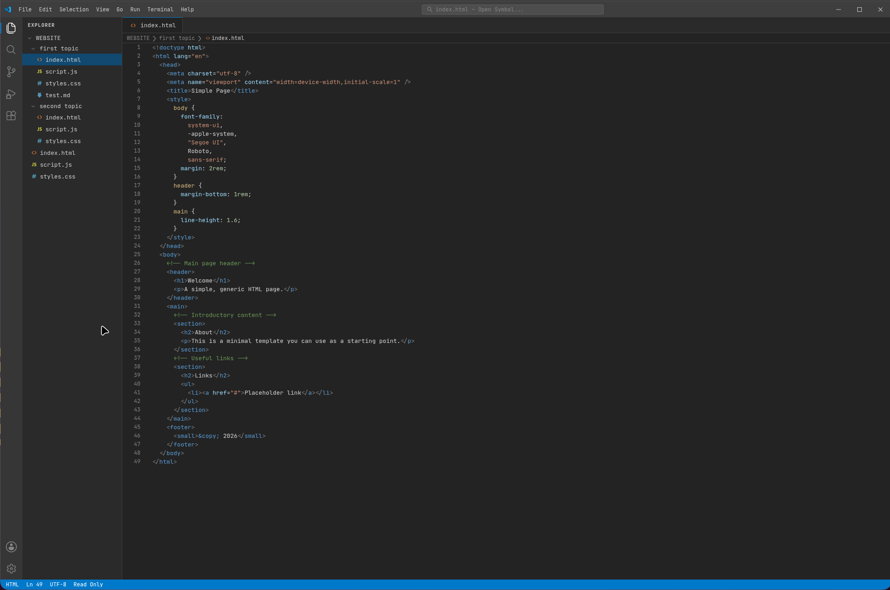

# vscode_website

A browser-based file viewer that looks and like VSCode. Drop files into `src/open_folder/`, run the dev server, and you get a read-only VSCode-style interface — sidebar tree, tab bar, line numbers, syntax highlighting via Shiki, the whole thing.

The idea is to embed it in a portfolio or project page so visitors can browse source files without leaving the browser.

## How it works

A custom Vite plugin reads everything in `src/open_folder/` at build time and bundles it into a virtual module (`virtual:open-folder-files`). The React app consumes that module — no runtime file I/O, no server. The output is a fully static site.

Subdirectories are supported and show up as collapsible folders in the sidebar, just like the real thing.

So, all the files in the open_folder are just decoration and need to be adjusted to whatever you want them to say, the rest of the project is the vscode template

```
src/
└─ open_folder/
   ├─ index.html
   ├─ script.js
   ├─ styles.css
   ├─ first topic/
   │  ├─ index.html
   │  ├─ script.js
   │  ├─ styles.css
   │  └─ test.md
   └─ second topic/
      ├─ index.html
      ├─ script.js
      └─ styles.css
```

## Getting started

```bash
npm run build    # type-check + production build
npm run preview  # serve the build locally
```

## Supported file types

TypeScript, TSX, JavaScript, JSX, HTML, CSS, JSON, Markdown, Python, Rust, Go, Java, C/C++, PHP, Ruby, SQL, YAML, TOML, XML, Vue, Svelte, and shell scripts.

## Stack

- React 19
- Vite 8
- Shiki (syntax highlighting)
- TypeScript
