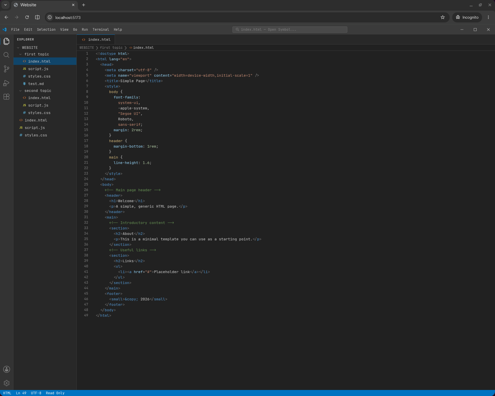

# vscode_website

A browser-based file viewer that looks and like VSCode. Drop files into `src/open_folder/`, run the dev server, and you get a read-only VSCode-style interface — sidebar tree, tab bar, line numbers, syntax highlighting via Shiki, the whole thing.

The idea is to embed it in a portfolio or project page so visitors can browse source files without leaving the browser.

**Preview for html and md files**

A custom Vite plugin reads everything in `src/open_folder/` at build time and bundles it into a virtual module. No runtime file I/O, no server — the output is a fully static site. See the in-app documentation for a full breakdown.

## Getting started

```bash
npm run build    # type-check + production build
npm run preview  # serve the build locally
```

You might need to adjust the base path in the vite.config.ts file to fit your setup

## Demo and Documentation

On this [page](https://tonix401.github.io/vscode_website/) you can see and play with a demo and read the documentation

## Stack

- React 19
- Vite 8
- Shiki (syntax highlighting)
- TypeScript